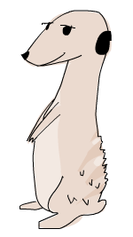
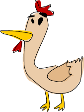

#构造我们自己的类型和类型类

##数据类型入门

在前面的章节中，我们谈了一些Haskell内置的类型和类型类。而在本章，我们将学习构造类型和类型类的方法。

我们以已经见识了许多数据类型，如``Bool``、``Int``、``Char``、``Maybe``等等，不过该怎样构造自己的数据类型呢？好问题，使用data关键字是一种方法。我们看看``Bool``在标准库中的定义：

```
data Bool = False | True
```

*data*表示我们要定义一个新的数据类型。=的左端标明类型的名称即``Bool``，``=``的右端就是*值构造子*（_Value Constructor_），它们明确了该类型可能的值。``|``读作“或”，所以可以这样阅读该声明：``Bool``类型的值可以是True或False。类型名和值构造子的首字母必大写。

相似，我们可以假想``Int``类型的声明：

```
data Int = -2147483648 | -2147483647 | ... | -1 | 0 | 1 | 2 | ... | 2147483647
```


首位两个值构造子分别表示了Int类型可能的最小值和最大值，这些省略号表示我们省去了中间大段的数字。当然，真实的声明不是这个样子的，这样写只是为了便于理解。

我们想想Haskell中图形的表示方法。表示圆可以用一个元组，如``(43.1,55.0,10.4)``，前两项表示圆心的位置，末项表示半径。听着不错，不过三维向量或其它什么东西也可能是这种形式！更好的方法就是自己构造一个表示图形的类型。假定图形可以是圆（Circle）或长方形（Rectangle）：

```
data Shape = Circle Float Float Float | Rectangle Float Float Float Float
```

这是啥，想想？``Circle``的值构造子有三个项，都是Float。可见我们在定义值构造子时，可以在后面跟几个类型表示它包含值的类型。在这里，前两项表示圆心的坐标，尾项表示半径。``Rectangle``的值构造子取四个Float项，前两项表示其左上角的坐标，后两项表示右下角的坐标。

谈到“项”(field)，其实应为“参数”(parameters)。值构造子的本质是个函数，可以返回一个类型的值。我们看下这两个值构造子的类型声明：

```
ghci> :t Circle
Circle :: Float -> Float -> Float -> Shape
ghci> :t Rectangle
Rectangle :: Float -> Float -> Float -> Float -> Shape
```

Cool，这么说值构造子就跟普通函数并无二致咯，谁想得到？我们写个函数计算图形面积：

```
surface :: Shape -> Float
surface (Circle _ _ r) = pi * r ^ 2
surface (Rectangle x1 y1 x2 y2) = (abs $ x2 - x1) * (abs $ y2 - y1)
```

值得一提的是，它的类型声明表示了该函数取一个Shape值并返回一个Float值。写``Circle -> Float``是不可以的，因为Circle并非类型，真正的类型应该是Shape。这与不能写``True->False``的道理是一样的。再就是，我们使用的模式匹配针对的都是值构造子。之前我们匹配过``[]``、``False``或``5``，它们都是不包含参数的值构造子。

我们只关心圆的半径，因此不需理会表示坐标的前两项：

```
ghci> surface $ Circle 10 20 10
314.15927
ghci> surface $ Rectangle 0 0 100 100
10000.0
```

Yay，it works！不过我们若尝试输出``Circle 10 20``到控制台，就会得到一个错误。这是因为Haskell还不知道该类型的字符串表示方法。想想，当我们往控制台输出值的时候，Haskell会先调用show函数得到这个值的字符串表示才会输出。因此要让我们的Shape类型成为Show类型类的成员。可以这样修改：

```
data Shape = Circle Float Float Float | Rectangle Float Float Float Float deriving (Show)
```

先不去深究*deriving*（派生），可以先这样理解：若在data声明的后面加上``deriving (Show)``，那Haskell就会自动将该类型至于Show类型类之中。好了，由于值构造子是个函数，因此我们可以拿它交给map，拿它不全调用，以及普通函数能做的一切。

```
ghci> Circle 10 20 5
Circle 10.0 20.0 5.0
ghci> Rectangle 50 230 60 90
Rectangle 50.0 230.0 60.0 90.0
```

我们若要取一组不同半径的同心圆，可以这样：

```
ghci> map (Circle 10 20) [4,5,6,6]
[Circle 10.0 20.0 4.0,Circle 10.0 20.0 5.0,Circle 10.0 20.0 6.0,Circle 10.0 20.0 6.0]
```

我们的类型还可以更好。增加加一个表示二维空间中点的类型，可以让我们的Shape更加容易理解：

```
data Point = Point Float Float deriving (Show)
data Shape = Circle Point Float | Rectangle Point Point deriving (Show)
```

注意下Point的定义，它的类型与值构造子用了相同的名字。没啥特殊含义，实际上，在一个类型含有唯一值构造子时这种重名是很常见的。好的，如今我们的Circle含有两个项，一个是Point类型，一个是Float类型，好作区分。Rectangle也是同样，我们得修改surface函数以适应类型定义的变动。

```
surface :: Shape -> Float
surface (Circle _ r) = pi * r ^ 2
surface (Rectangle (Point x1 y1) (Point x2 y2)) = (abs $ x2 - x1) * (abs $ y2 - y1)
```

唯一需要修改的地方就是模式。在Circle的模式中，我们无视了整个Point。而在Rectangle的模式中，我们用了一个嵌套的模式来取得Point中的项。若出于某原因而需要整个Point，那么直接匹配就是了。

```
ghci> surface (Rectangle (Point 0 0) (Point 100 100))
10000.0
ghci> surface (Circle (Point 0 0) 24)
1809.5574
```

表示移动一个图形的函数该怎么写？ 它应当取一个Shape和表示位移的两个数，返回一个位于新位置的图形。

```
nudge :: Shape -> Float -> Float -> Shape
nudge (Circle (Point x y) r) a b = Circle (Point (x+a) (y+b)) r
nudge (Rectangle (Point x1 y1) (Point x2 y2)) a b = Rectangle (Point (x1+a) (y1+b)) (Point (x2+a) (y2+b))
```

很直白，我们给这一Shape的点加上位移的量。

```
ghci> nudge (Circle (Point 34 34) 10) 5 10
Circle (Point 39.0 44.0) 10.0
```

如果不想直接处理Point，我们可以搞个辅助函数(auxilliary function)，初始从原点创建图形，再移动它们。

```
baseCircle :: Float -> Shape
baseCircle r = Circle (Point 0 0) r

baseRect :: Float -> Float -> Shape
baseRect width height = Rectangle (Point 0 0) (Point width height)
```

```
ghci> nudge (baseRect 40 100) 60 23
Rectangle (Point 60.0 23.0) (Point 100.0 123.0)
```

毫无疑问，你可以把你的数据类型导出到模块中。只要把你的类型与要导出的函数写到一起就是了。再在后面跟个括号，列出要导出的值构造子，用逗号隔开。如要导出所有的值构造子，那就写个..。

若要将这里定义的所有函数和类型都导出到一个模块中，可以这样：

```
module Shapes
( Point(..)
, Shape(..)
, surface
, nudge
, baseCircle
, baseRect
) where
```

一个Shape (..)，我们就导出了``Shape``的所有值构造子。这一来无论谁导入我们的模块，都可以用``Rectangle``和``Circle``值构造子来构造Shape了。这与写``Shape(Rectangle,Circle)``等价。

我们可以选择不导出任何Shape的值构造子，这一来使用我们模块的人就只能用辅助函数``baseCircle``和``baseRect``来得到``Shape``了。``Data.Map``就是这一套，没有``Map.Map [(1,2),(3,4)]``，因为它没有导出任何一个值构造子。但你可以用，像``Map.fromList``这样的辅助函数得到map。应该记住，值构造子只是函数而已，如果不导出它们，就拒绝了使用我们模块的人调用它们。但可以使用其他返回该类型的函数，来取得这一类型的值。

不导出数据类型的值构造子隐藏了他们的内部实现，令类型的抽象度更高。同时，我们模块的使用者也就无法使用该值构造子进行模式匹配了。


##Record Syntax

OK，我们需要一个数据类型来描述一个人，得包含他的姓、名、年龄、身高、体重、电话号码以及最爱的冰激淋。我不知你的想法，不过我觉得要了解一个人，这些资料就够了。就这样，实现出来！

```
data Person = Person String String Int Float String String deriving (Show)
```

O~Kay，第一项是名，第二项是姓，第三项是年龄，等等。我们造一个人：

```
ghci> let guy = Person "Buddy" "Finklestein" 43 184.2 "526-2928" "Chocolate"
ghci> guy
Person "Buddy" "Finklestein" 43 184.2 "526-2928" "Chocolate"
```

貌似很酷，就是难读了点儿。弄个函数得人的某项资料又该如何？如姓的函数，名的函数，等等。好吧，我们只能这样：

```
firstName :: Person -> String
firstName (Person firstname _ _ _ _ _) = firstname

lastName :: Person -> String
lastName (Person _ lastname _ _ _ _) = lastname

age :: Person -> Int
age (Person _ _ age _ _ _) = age

height :: Person -> Float
height (Person _ _ _ height _ _) = height

phoneNumber :: Person -> String
phoneNumber (Person _ _ _ _ number _) = number

flavor :: Person -> String
flavor (Person _ _ _ _ _ flavor) = flavor
```

唔，我可不愿写这样的代码！虽然it works，但也太无聊了哇。

```
ghci> let guy = Person "Buddy" "Finklestein" 43 184.2 "526-2928" "Chocolate"
ghci> firstName guy
"Buddy"
ghci> height guy
184.2
ghci> flavor guy
"Chocolate"
```

你可能会说，一定有更好的方法！呃，抱歉，没有。

开个玩笑，其实有的，哈哈哈～Haskell的发明者都是天才，早就料到了此类情形。他们引入了一个特殊的类型，也就是刚才提到的更好的方法-- *Record Syntax*。

```
data Person = Person { firstName :: String
                     , lastName :: String
                     , age :: Int
                     , height :: Float
                     , phoneNumber :: String
                     , flavor :: String
                     } deriving (Show)
```

与原先让那些项一个挨一个的空格隔开不同，这里用了花括号{}。先写出项的名字，如firstName，后跟两个冒号（也叫Raamayim Nekudotayim，哈哈~(译者不知道什么意思~囧)），标明其类型，返回的数据类型仍与以前相同。这样的好处就是，可以用函数从中直接按项取值。通过Record Syntax，haskell就自动生成了这些函数：``firstName``,``lastName``,``age``,``height``,``phoneNumber``和``flavor``。

```
ghci> :t flavor
flavor :: Person -> String
ghci> :t firstName
firstName :: Person -> String
```

还有个好处，就是若派生(deriving)到``Show``类型类，它的显示是不同的。假如我们有个类型表示一辆车，要包含生产商、型号以及出场年份：

```
data Car = Car String String Int deriving (Show)
```

```
ghci> Car "Ford" "Mustang" 1967
Car "Ford" "Mustang" 1967
```

若用Record Syntax，就可以得到像这样的新车：

```
data Car = Car {company :: String, model :: String, year :: Int} deriving (Show)
```

```
ghci> Car {company="Ford", model="Mustang", year=1967}
Car {company = "Ford", model = "Mustang", year = 1967}
```

这一来在造车时我们就不必关心各项的顺序了。

表示三维向量之类简单数据，``Vector = Vector Int Int Int`` 就足够明白了。但一个值构造子中若含有很多个项且不易区分，如一个人或者一辆车啥的，就应该使用Record Syntax。


##类型参数

值构造子可以取几个参数产生一个新值，如Car的构造子是取三个参数返回一个Car。与之相似，类型构造子可以取类型作参数，产生新的类型。这咋一听貌似有点深奥，不过实际上并不复杂。如果你对C++的模板有了解，就会看到很多相似的地方。我们看一个熟悉的类型，好对类型参数有个大致印象：

```
data Maybe a = Nothing | Just a
```


这里的a就是个类型参数。也正因为有了它，Maybe就成为了一个类型构造子。在它的值不是Nothing时，它的类型构造子可以搞出Maybe Int，Maybe String等等诸多类型。但只一个Maybe是不行的，因为它不是类型，而是类型构造子。要成为真正的类型，必须得把它需要的类型参数全部填满。

所以，如果拿``Char``作参数交给``Maybe``，就可以得到一个``Maybe Char`` 的类型。如，``Just 'a'``的类型就是``Maybe Char``  。

你可能并未察觉，在遇见Maybe之前我们早就接触到类型参数了。它便是List类型。这里面有点语法糖，List类型实际上就是取一个参数来生成一个特定类型，这类型可以是[Int]，[Char]也可以是[String]，但不会跟在[]的后面。

把玩一下``Maybe``！

```
ghci> Just "Haha"
Just "Haha"
ghci> Just 84
Just 84
ghci> :t Just "Haha"
Just "Haha" :: Maybe [Char]
ghci> :t Just 84
Just 84 :: (Num t) => Maybe t
ghci> :t Nothing
Nothing :: Maybe a
ghci> Just 10 :: Maybe Double
Just 10.0
```

类型参数很实用。有了它，我们就可以按照我们的需要构造出不同的类型。若执行``:t Just "Haha"``，类型推导引擎就会认出它是个``Maybe [Char]``，由于``Just a``里的``a``是个字符串，那么``Maybe a``里的``a``一定也是个字符串。



注意下，``Nothing``的类型为``Maybe a``。它是多态的，若有函数取``Maybe Int``类型的参数，就一概可以传给它一个Nothing，因为Nothing中不包含任何值。``Maybe a``类型可以有``Maybe Int``的行为，正如``5``可以是``Int``也可以是``Double``。与之相似，空List的类型是``[a]``，可以与一切List打交道。因此，我们可以``[1,2,3]++[]``，也可以``["ha","ha,","ha"]++[]``。

类型参数有很多好处，但前提是用对了地方才行。一般都是不关心类型里面的内容，如Maybe a。一个类型的行为若有点像是容器，那么使用类型参数会是个不错的选择。我们完全可以把我们的Car类型从

```
data Car = Car { company :: String
                 , model :: String
                 , year :: Int
                 } deriving (Show)
```

改成：

```
data Car a b c = Car { company :: a
                       , model :: b
                       , year :: c
                        } deriving (Show)
```

但是，这样我们又得到了什么好处？回答很可能是，一无所得。因为我们只定义了处理``Car String String Int``类型的函数，像以前，我们还可以弄个简单函数来描述车的属性。

```
tellCar :: Car -> String
tellCar (Car {company = c, model = m, year = y}) = "This " ++ c ++ " " ++ m ++ " was made in " ++ show y
```

```
ghci> let stang = Car {company="Ford", model="Mustang", year=1967}
ghci> tellCar stang
"This Ford Mustang was made in 1967"
```

可爱的小函数！它的类型声明得很漂亮，而且工作良好。好，如果改成Car a b c又会怎样？

```
tellCar :: (Show a) => Car String String a -> String
tellCar (Car {company = c, model = m, year = y}) = "This " ++ c ++ " " ++ m ++ " was made in " ++ show y
```

我们只能强制性地给这个函数安一个(Show a) => Car String String a 的类型约束。看得出来，这要繁复得多。而唯一的好处貌似就是，我们可以使用Show类型类的实例来作a的类型。

```
ghci> tellCar (Car "Ford" "Mustang" 1967)
"This Ford Mustang was made in 1967"
ghci> tellCar (Car "Ford" "Mustang" "nineteen sixty seven")
"This Ford Mustang was made in \"nineteen sixty seven\""
ghci> :t Car "Ford" "Mustang" 1967
Car "Ford" "Mustang" 1967 :: (Num t) => Car [Char] [Char] t
ghci> :t Car "Ford" "Mustang" "nineteen sixty seven"
Car "Ford" "Mustang" "nineteen sixty seven" :: Car [Char] [Char] [Char]
```

其实在现实生活中，使用Car String String Int在大多数情况下已经满够了。所以给Car类型加类型参数貌似并没有什么必要。通常我们都是都是在一个类型中包含的类型并不影响它的行为时才引入类型参数。一组什么东西组成的List就是一个List，它不关心里面东西的类型是啥，然而总是工作良好。若取一组数字的和，我们可以在后面的函数体中明确是一组数字的List。Maybe与之相似，它表示可以有什么东西可以没有，而不必关心这东西是啥。

我们之前还遇见过一个类型参数的应用，就是Data.Map中的Map k v。k表示Map中键的类型，v表示值的类型。这是个好例子，map中类型参数的使用允许我们能够用一个类型索引另一个类型，只要键的类型在Ord类型类就行。如果叫我们自己定义一个map类型，可以在data声明中加上一个类型类的约束。

```
data (Ord k) => Map k v = ...
```

然而haskell中有一个严格的约定，那就是永远不要在data声明中添加类型约束。为啥？嗯，因为这样没好处，反而得写更多不必要的类型约束。Map k v要是有Ord k的约束，那就相当于假定每个map的相关函数都认为k是可排序的。若不给数据类型加约束，我们就不必给那些不关心键是否可排序的函数另加约束了。这类函数的一个例子就是toList，它只是把一个map转换为关联List罢了，类型声明为``toList :: Map k v -> [(k, v)]``。要是加上类型约束，就只能是``toList :: (Ord k) =>Map k a -> [(k,v)]``，明显没必要嘛。

所以说，永远不要在data声明中加类型约束---即便看起来没问题。免得在函数声明中写出过多无畏的类型约束。

我们实现个表示三维向量的类型，再给它加几个处理函数。我么那就给它个类型参数，虽然大多数情况都是数值型，不过这一来它就支持了多种数值类型。

```
data Vector a = Vector a a a deriving (Show)
vplus :: (Num t) => Vector t -> Vector t -> Vector t
(Vector i j k) `vplus` (Vector l m n) = Vector (i+l) (j+m) (k+n)
vectMult :: (Num t) => Vector t -> t -> Vector t
(Vector i j k) `vectMult` m = Vector (i*m) (j*m) (k*m)
scalarMult :: (Num t) => Vector t -> Vector t -> t
(Vector i j k) `scalarMult` (Vector l m n) = i*l + j*m + k*n
```

vplus用来相加两个向量，即将其所有对应的项相加。``scalarMult``用来求两个向量的标量积，``vectMult``求一个向量和一个标量的积。这些函数可以处理``Vector Int``，``Vector Integer``，``Vector Float``等等类型，只要``Vector a``里的这个``a``在Num类型类中就行。同样，如果你看下这些函数的类型声明就会发现，它们只能处理相同类型的向量，其中包含的数字类型必须与另一个向量一致。注意，我们并没有在data声明中添加Num的类约束。反正无论怎么着都是给函数加约束。

再度重申，类型构造子和值构造子的区分是相当重要的。在声明数据类型时，等号=左端的那个是类型构造子，右端的（中间可能有|分隔）都是值构造子。拿``Vector t t t -> Vector t t t -> t``作函数的类型就会产生一个错误，因为在类型声明中只能写类型，而Vector的类型构造子只有个参数，它的值构造子才是有三个。我们就慢慢耍：

```
ghci> Vector 3 5 8 `vplus` Vector 9 2 8
Vector 12 7 16
ghci> Vector 3 5 8 `vplus` Vector 9 2 8 `vplus` Vector 0 2 3
Vector 12 9 19
ghci> Vector 3 9 7 `vectMult` 10
Vector 30 90 70
ghci> Vector 4 9 5 `scalarMult` Vector 9.0 2.0 4.0
74.0
ghci> Vector 2 9 3 `vectMult` (Vector 4 9 5 `scalarMult` Vector 9 2 4)
Vector 148 666 222
```


##派生实例

在typeclass 101那节里面，我们了解了typeclass的基础内容。里面提到，类型类就是定义了某些行为的接口。例如，Int类型是Eq类型类的一个实例，Eq类就定义了判定相等性的行为。Int值可以判断相等性，所以Int就是Eq类型类的成员。它的真正威力体现在作为Eq接口的函数中，即==和/=。只要一个类型是Eq类型类的成员，我们就可以使用==函数来处理这一类型。这便是为何``4==4``和``"foo"/="bar"``这样的表达式都需要作类型检查。


我们也曾提到，人们很容易把类型类与Java，python，C++等语言的类混淆。很多人对此都倍感不解，在原先那些语言中，类就像是蓝图，我们可以根据它来创造对象、保存状态并执行操作。而类型类更像是接口，我们不是靠它构造数据，而是给既有的数据类型描述行为。什么东西若可以判定相等性，我们就可以让它成为Eq类型类的实例。什么东西若可以比较大小，那就可以让它成为Ord类型类的实例。

在下一节，我们将看一下如何手工实现类型类中定义函数来构造实例。现在呢，我们先了解下Haskell是如何自动生成这几个类型类的实例，``Eq``,``Ord``,``Enum``,``Bounded``,``Show``,``Read``。只要我们在构造类型时在后面加个deriving（派生）关键字，Haskell就可以自动地给我们的类型加上这些行为。

看这个数据类型：

```
data Person = Person { firstName :: String
                     , lastName :: String
                     , age :: Int
                     }
```

这描述了一个人。我们先假定世界上没有重名重姓又同龄的人存在，好，假如有两个record，有没有可能是描述同一个人呢？当然可能，我么可以判定姓名年龄的相等性，来判断它俩是否相等。这一来，让这个类型成为Eq的成员就很靠谱了。直接derive这个实例：

```
data Person = Person { firstName :: String
                     , lastName :: String
                     , age :: Int
                     } deriving (Eq)
```

在一个类型派生为Eq的实例后，就可以直接使用==或/=来判断它们的相等性了。Haskell会先看下这两个值的值构造子是否一致（这里只是单值构造子），再用==来检查其中的所有数据（必须都是Eq的成员）是否一致。在这里只有String和Int，所以是没有问题的。测试下我们的Eq实例：

```
ghci> let mikeD = Person {firstName = "Michael", lastName = "Diamond", age = 43}
ghci> let adRock = Person {firstName = "Adam", lastName = "Horovitz", age = 41}
ghci> let mca = Person {firstName = "Adam", lastName = "Yauch", age = 44}
ghci> mca == adRock
False
ghci> mikeD == adRock
False
ghci> mikeD == mikeD
True
ghci> mikeD == Person {firstName = "Michael", lastName = "Diamond", age = 43}
True
```

自然，Person如今已经成为了Eq的成员，我们就可以将其应用于所有在类型声明中用到Eq类约束的函数了，如elem。

```
ghci> let beastieBoys = [mca, adRock, mikeD]
ghci> mikeD `elem` beastieBoys
True
```

Show和Read类型类处理可与字符串相互转换的东西。同Eq相似，如果一个类型的构造子含有参数，那所有参数的类型必须都得属于Show或Read才能让该类型成为其实例。就让我们的Person也成为Read和Show的一员吧。

```
data Person = Person { firstName :: String
                     , lastName :: String
                     , age :: Int
                     } deriving (Eq, Show, Read)
```

然后就可以输出一个Person到控制台了。

```
ghci> let mikeD = Person {firstName = "Michael", lastName = "Diamond", age = 43}
ghci> mikeD
Person {firstName = "Michael", lastName = "Diamond", age = 43}
ghci> "mikeD is: " ++ show mikeD
"mikeD is: Person {firstName = \"Michael\", lastName = \"Diamond\", age = 43}"
```

如果我们还没让Person类型作为Show的成员就尝试输出它，haskell就会向我们抱怨，说它不知道该怎么把它表示成一个字符串。不过现在既然已经派生成为了Show的一个实例，它就知道了。

Read几乎就是与Show相对的类型类，show是将一个值转换成字符串，而read则是将一个字符串转成某类型的值。还记得，使用read函数时我们必须得用类型注释注明想要的类型，否则haskell就不会知道如何转换。

```
ghci> read "Person {firstName =\"Michael\", lastName =\"Diamond\", age = 43}" :: Person
Person {firstName = "Michael", lastName = "Diamond", age = 43}
```

如果我们read的结果会在后面用到参与计算，Haskell就可以推导出是一个Person的行为，不加注释也是可以的。

```
ghci> read "Person {firstName =\"Michael\", lastName =\"Diamond\", age = 43}" == mikeD
True
```

也可以read带参数的类型，但必须填满所有的参数。因此``read "Just 't'" :: Maybe a``是不可以的，``read "Just 't'" :: Maybe Char``才对。

很容易想象Ord类派生实例的行为。首先，判断两个值构造子是否一致，如果是，再判断它们的参数，前提是它们的参数都得是Ord的实例。Bool类型可以有两种值，False和True。为了了解在比较中程序的行为，我们可以这样想象：

```
data Bool = False | True deriving (Ord)
```

由于值构造子False安排在True的前面，我们可以认为True比False大。

```
ghci> True `compare` False
GT
ghci> True > False
True
ghci> True
False
```

在Maybe a数据类型中，值构造子Nothing在Just值构造子前面，所以一个``Nothing``总要比``Just something``的值小。即便这个``something``是``100000000``也是如此。

```
ghci> Nothing
True
ghci> Nothing > Just (-49999)
False
ghci> Just 3 `compare` Just 2
GT
ghci> Just 100 > Just 50
True
```

不过类似Just (*3), Just(*2)之类的代码是不可以的。因为(*3)和(*2)都是函数，而函数不是Ord类的成员。

作枚举，使用数字类型就能轻易做到。不过使用Enmu和Bounded类型类会更好，看下这个类型：

```
data Day = Monday | Tuesday | Wednesday | Thursday | Friday | Saturday | Sunday
```

所有的值构造子都是nullary的（也就是没有参数），每个东西都有前置子和后继子，我们可以让它成为Enmu类型类的成员。同样，每个东西都有可能的最小值和最大值，我们也可以让它成为Bounded类型类的成员。在这里，我们就同时将它搞成其它可派生类型类的实例。再看看我们能拿它做啥：

```
data Day = Monday | Tuesday | Wednesday | Thursday | Friday | Saturday | Sunday
           deriving (Eq, Ord, Show, Read, Bounded, Enum)
```

由于它是Show和Read类型类的成员，我们可以将这个类型的值与字符串相互转换。

```
ghci> Wednesday
Wednesday
ghci> show Wednesday
"Wednesday"
ghci> read "Saturday" :: Day
Saturday
```

由于它是Eq与Ord的成员，因此我们可以拿Day作比较。

```
ghci> Saturday == Sunday
False
ghci> Saturday == Saturday
True
ghci> Saturday > Friday
True
ghci> Monday `compare` Wednesday
LT
```

它也是Bounded的成员，因此有最早和最晚的一天。

```
ghci> minBound :: Day
Monday
ghci> maxBound :: Day
Sunday
```

它也是Enmu的实例，可以得到前一天和后一天，并且可以对此使用List的区间。

```
ghci> succ Monday
Tuesday
ghci> pred Saturday
Friday
ghci> [Thursday .. Sunday]
[Thursday,Friday,Saturday,Sunday]
ghci> [minBound .. maxBound] :: [Day]
[Monday,Tuesday,Wednesday,Thursday,Friday,Saturday,Sunday]
```

那是相当的棒。


##类型别名


在前面我们提到在写类型名的时候，``[Char]``和``String``等价，可以互换。这就是由类型别名实现的。类型别名实际上什么也没做，只是给类型提供了不同的名字，让我们的代码更容易理解。这就是``[Char]``的别名``String``的由来。

```
type String = [Char]
```

我们已经介绍过了type关键字，这个关键字有一定误导性，它并不是用来创造新类（这是data关键字做的事情），而是给一个既有类型提供一个别名。

如果我们随便搞个函数toUpperString或其他什么名字，将一个字符串变成大写，可以用这样的类型声明``toUpperString :: [Char] -> [Char]``， 也可以这样``toUpperString :: String -> String``，二者在本质上是完全相同的。后者要更易读些。

在前面Data.Map那部分，我们用了一个关联List来表示``phoneBook``，之后才改成的Map。我们已经发现了，一个关联List就是一组键值对组成的List。再看下我们phoneBook的样子：

```
phoneBook :: [(String,String)]
phoneBook =
    [("betty","555-2938")
    ,("bonnie","452-2928")
    ,("patsy","493-2928")
    ,("lucille","205-2928")
    ,("wendy","939-8282")
    ,("penny","853-2492")
    ]
```

可以看出，phoneBook的类型就是``[(String,String)]``，这表示一个关联List仅是String到String的映射关系。我们就弄个类型别名，好让它类型声明中能够表达更多信息。

```
type PhoneBook = [(String,String)]
```

现在我们phoneBook的类型声明就可以是phoneBook :: PhoneBook了。再给字符串加上别名：

```
type PhoneNumber = String
type Name = String
type PhoneBook = [(Name,PhoneNumber)]
```

Haskell程序员给String加别名是为了让函数中字符串的表达方式及用途更加明确。

好的，我们实现了一个函数，它可以取一名字和号码检查它是否存在于电话本。现在可以给它加一个相当好看明了的类型声明：

```
inPhoneBook :: Name -> PhoneNumber -> PhoneBook -> Bool
inPhoneBook name pnumber pbook = (name,pnumber) `elem` pbook
```



如果不用类型别名，我们函数的类型声明就只能是``String -> String -> [(String ,String)] -> Bool``了。在这里使用类型别名是为了让类型声明更加易读，但你也不必拘泥于它。引入类型别名的动机既非单纯表示我们函数中的既有类型，也不是为了替换掉那些重复率高的长名字类型(如``[(String,String)]``)，而是为了让类型对事物的描述更加明确。

类型别名也是可以有参数的，如果你想搞个类型来表示关联List，但依然要它保持通用，好让它可以使用任意类型作key和value，我们可以这样：

```
type AssocList k v = [(k,v)]
```

好的，现在一个从关联List中按键索值的函数类型可以定义为``(Eq k) => k -> AssocList k v -> Maybe v. AssocList i``。AssocList是个取两个类型做参数生成一个具体类型的类型构造子，如``Assoc Int String``等等。

    *Fronzie说*：Hey！当我提到具体类型，那我就是说它是完全调用的，就像``Map Int String``。要不就是多态函数中的``[a]``或``(Ord a) => Maybe a``之类。有时我和孩子们会说“Maybe类型”，但我们的意思并不是按字面来，傻瓜都知道Maybe是类型构造子嘛。只要用一个明确的类型调用Maybe，如``Maybe String``可得一个具体类型。你知道，只有具体类型才可以储存值。

我们可以用不全调用来得到新的函数，同样也可以使用不全调用得到新的类型构造子。同函数一样，用不全的类型参数调用类型构造子就可以得到一个不全调用的类型构造子，如果我们要一个表示从整数到某东西间映射关系的类型，我们可以这样：

```
type IntMap v = Map Int v
```

也可以这样：

```
type IntMap = Map Int
```

无论怎样，IntMap的类型构造子都是取一个参数，而它就是这整数指向的类型。

Oh yeah，如果要你去实现它，很可能会用个qualified import来导入Data.Map。这时，类型构造子前面必须得加上模块名。所以应该写个``type IntMap = Map.Map Int``

你得保证真正弄明白了类型构造子和值构造子的区别。我们有了个叫IntMap或者AssocList的别名并不意味着我们可以执行类似``AssocList [(1,2),(4,5),(7,9)]``的代码，而是可以用不同的名字来表示原先的List，就像``[(1,2),(4,5),(7,9)] :: AssocList Int Int``让它里面的类型都是Int。而像处理普通的二元组构成的那种List处理它也是可以的。类型别名（类型依然不变），只可以在Haskell的类型部分中使用，像定义新类型或类型声明或类型注释中跟在::后面的部分。

另一个很酷的二参类型就是``Either a b``了，它大约是这样定义的：

```
data Either a b = Left a | Right b deriving (Eq, Ord, Read, Show)
```

它有两个值构造子。如果用了Left，那它内容的类型就是a；用了Right，那它内容的类型就是b。我们可以用它来将可能是两种类型的值封装起来，从里面取值时就同时提供Left和Right的模式匹配。

```
ghci> Right 20
Right 20
ghci> Left "w00t"
Left "w00t"
ghci> :t Right 'a'
Right 'a' :: Either a Char
ghci> :t Left True
Left True :: Either Bool b
```

到现在为止，Maybe是最常见的表示可能失败的计算的类型了。但有时Maybe也并不是十分的好用，因为Nothing中包含的信息还是太少。要是我们不关心函数失败的原因，它还是不错的。就像Data.Map的lookup只有在搜寻的项不在map时才会失败，对此我们一清二楚。但我们若想知道函数失败的原因，那还得使用Either a b，用a来表示可能的错误的类型，用b来表示一个成功运算的类型。从现在开始，错误一律用Left值构造子，而结果一律用Right。

一个例子：有个学校提供了不少壁橱，好给学生们地方放他们的Gun'N'Rose海报。每个壁橱都有个密码，哪个学生想用个壁橱，就告诉管理员壁橱的号码，管理员就会告诉他壁橱的密码。但如果这个壁橱已经让别人用了，管理员就不能告诉他密码了，得换一个壁橱。我们就用Data.Map的一个map来表示这些壁橱，把一个号码映射到一个表示壁橱占用情况及密码的二元组里。

```
import qualified Data.Map as Map

data LockerState = Taken | Free deriving (Show, Eq)

type Code = String

type LockerMap = Map.Map Int (LockerState, Code)
```

很简单，我们引入了一个新的类型来表示壁橱的占用情况。并为壁橱密码及按号码找壁橱的map分别设置了一个别名。好，现在我们实现这个按号码找壁橱的函数，就用``Either String Code``类型表示我们的结果，因为lookup可能会以两种原因失败。厨子已经让别人用了或者压根就没有这个橱子。如果lookup失败，就用字符串表明失败的原因。

```
lockerLookup :: Int -> LockerMap -> Either String Code
lockerLookup lockerNumber map =
    case Map.lookup lockerNumber map of
        Nothing -> Left $ "Locker number " ++ show lockerNumber ++ " doesn't exist!"
        Just (state, code) -> if state /= Taken
                                then Right code
                                else Left $ "Locker " ++ show lockerNumber ++ " is already taken!"
```

我们在这里个map中执行一次普通的``lookup``，如果得到一个``Nothing``，就返回一个``Left String``的值，告诉他压根就没这个号码的橱子。如果找到了，就再检查下，看这橱子是不是已经让别人用了，如果是，就返回个``Left String``说它已经让别人用了。否则就返回个Right Code的值，通过它来告诉学生壁橱的密码。它实际上就是个``Right String``，我们引入了个类型别名让它这类型声明更好看。

如下是个map的例子：

```
lockers :: LockerMap
lockers = Map.fromList
    [(100,(Taken,"ZD39I"))
    ,(101,(Free,"JAH3I"))
    ,(103,(Free,"IQSA9"))
    ,(105,(Free,"QOTSA"))
    ,(109,(Taken,"893JJ"))
    ,(110,(Taken,"99292"))
    ]
```

现在从里面lookup某个橱子号..

```
ghci> lockerLookup 101 lockers
Right "JAH3I"
ghci> lockerLookup 100 lockers
Left "Locker 100 is already taken!"
ghci> lockerLookup 102 lockers
Left "Locker number 102 doesn't exist!"
ghci> lockerLookup 110 lockers
Left "Locker 110 is already taken!"
ghci> lockerLookup 105 lockers
Right "QOTSA"
```

我们完全可以用``Maybe a``来表示它的结果，但这样一来我们就对得不到密码的原因不得而知了。而在这里，我们的新类型可以告诉我们失败的原因。
